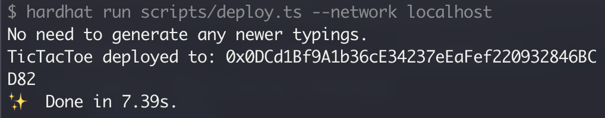

# Tic Tac Toe

This is a simple client to play tic tac toe on the blockchain.


## Prerequisites

Please take a look at the [contracts](https://github.com/Gideonnn/tic-tac-toe-contracts) repo and deploy the contract locally first. Output should look as follows:



Copy the `0x0DC...` hash (yours will be different). Now copy/rename the `.env.example` file to `.env` and place the hash behind `REACT_APP_CONTRACT_ADDRESS`.

## Install dependencies

```bash
yarn
```

## Start application

```bash
yarn start
```

## License

[WTFPL](http://www.wtfpl.net/)
